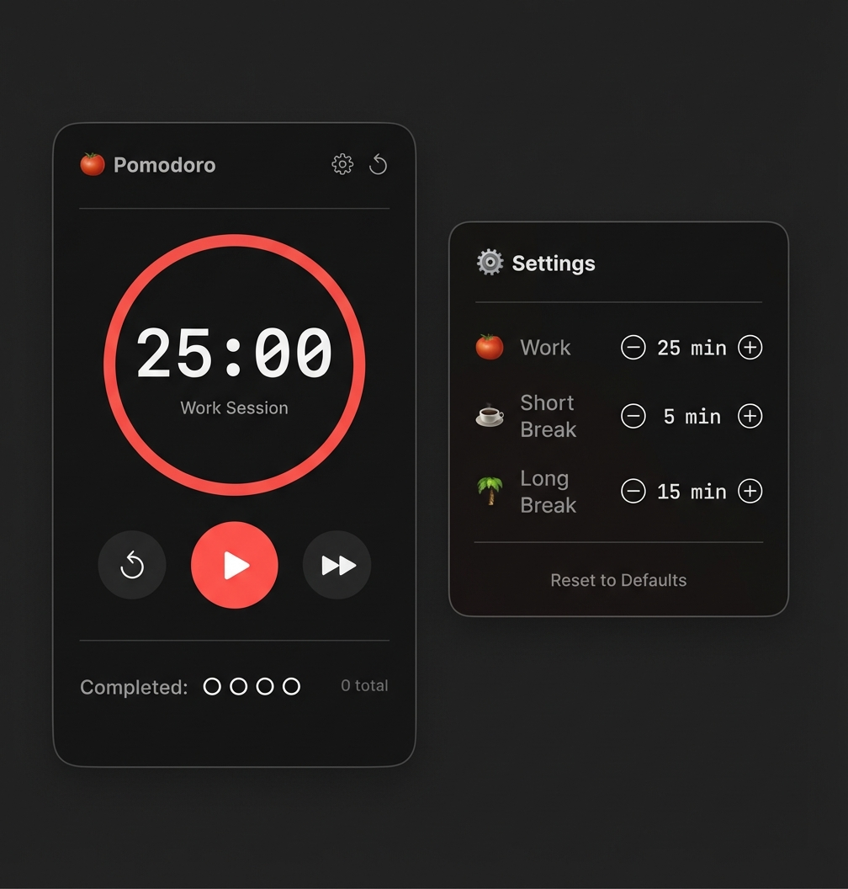

# Pomodoro macOS

A minimal, beautiful Pomodoro timer that lives in your macOS menu bar.


## Screenshots

<p align="center">
  
</p>

## Features

- 🍅 **Menu Bar App** - Lives in your menu bar, out of the way
- ⏱️ **Classic Pomodoro** - 25-min work, 5-min short break, 15-min long break
- ⚙️ **Configurable Timers** - Customize work and break durations to your preference
- 🔄 **Auto-Mode** - Optionally auto-start the next session for deep focus
- ⏳ **Countdown Overlay** - Subtle 5-second fullscreen countdown to help transitions
- 🔔 **Notifications** - Get notified when sessions complete
- 📊 **Session Counter** - Track completed pomodoros
- 🎨 **Progress Ring** - Visual circular progress indicator

## Installation

### Build from Source

```bash
# Clone the repo
git clone https://github.com/iburakct/pomodoro-macos.git
cd pomodoro-macos

# Build
xcodebuild -project Pomodoro.xcodeproj -scheme Pomodoro -configuration Release build CONFIGURATION_BUILD_DIR=./build

# Run
open ./build/Pomodoro.app

# Or install to Applications
cp -R ./build/Pomodoro.app /Applications/
```

### Open in Xcode

```bash
open Pomodoro.xcodeproj
```

Then press **⌘R** to build and run.

## Usage

1. Click the 🍅 icon in your menu bar
2. Press **Play** to start a 25-minute work session
3. Toggle **Auto-start next session** if you want seamless transitions
4. When complete, you'll get a notification and a subtle fullscreen countdown
5. Take your break, then repeat!

After 4 pomodoros, you get a 15-minute long break.

## Requirements

- macOS 14.0 (Sonoma) or later
- Xcode 15.0+ (for building)

## License

MIT
